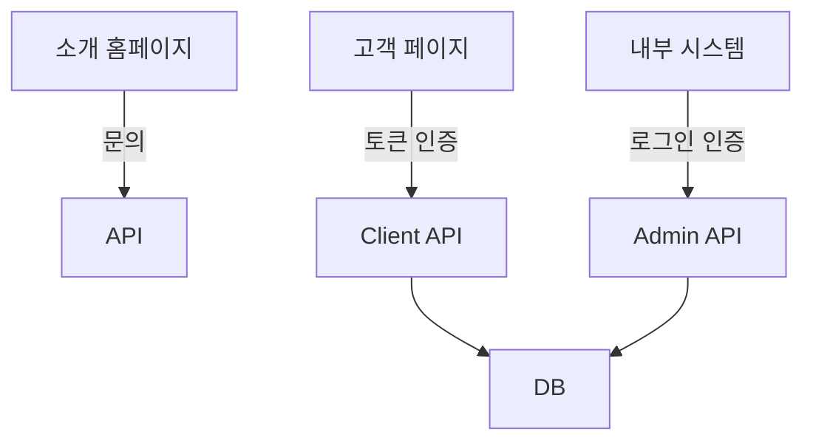

# 🏗️ MindGraphy 프로젝트 아키텍처

## 📋 개요

MindGraphy는 **단일 Next.js 프로젝트**로 3개의 독립적인 시스템을 운영합니다.

## 🎨 시스템 구성

### 1️⃣ 소개 홈페이지 (Marketing Site)
- **도메인**: `www.mindgraphy.com` 또는 `mindgraphy.com`
- **경로**: `/` (app/(public))
- **목적**: 서비스 소개, SEO, 마케팅
- **특징**: 
  - 완전 정적 페이지
  - 포트폴리오, 가격표, 문의하기
  - 고객 후기, 블로그
  - CTA: 고객용 페이지 & 내부 로그인

### 2️⃣ 고객용 페이지 (Client Portal)
- **도메인**: `portal.mindgraphy.com` 또는 `client.mindgraphy.com`
- **경로**: `/c/[token]/*` (app/(client))
- **목적**: 웨딩 고객 전용 포털
- **특징**:
  - 토큰 기반 인증 (로그인 불필요)
  - 프루프 갤러리, 사진 선택
  - 계약서 확인, 결제
  - 최종 사진 다운로드
  - 진행 상황 추적

### 3️⃣ 내부 업무 시스템 (Back Office)
- **도메인**: `admin.mindgraphy.com` 또는 `app.mindgraphy.com`
- **경로**: `/admin/*` (app/(admin))
- **목적**: 관리자 & 작가용 업무 관리
- **특징**:
  - 로그인 기반 인증
  - 권한별 접근 제어 (Admin / Photographer)
  - 스케줄 캘린더
  - 프로젝트 관리
  - 고객 CRM
  - 편집 큐, 배송 관리

## 📁 프로젝트 구조

```
mindgraphy/
├── app/
│   ├── (public)/          # 소개 홈페이지
│   │   ├── page.tsx       # 랜딩/포털 선택
│   │   ├── about/
│   │   ├── portfolio/
│   │   ├── pricing/
│   │   └── contact/
│   │
│   ├── (client)/          # 고객용 페이지
│   │   └── c/[token]/
│   │       ├── page.tsx
│   │       ├── contract/
│   │       ├── info/
│   │       ├── proof-gallery/
│   │       ├── payment/
│   │       └── download/
│   │
│   ├── (admin)/           # 내부 업무 시스템
│   │   └── admin/
│   │       ├── dashboard/
│   │       ├── calendar/
│   │       ├── projects/
│   │       ├── my/        # 작가 전용
│   │       └── settings/  # 관리자 전용
│   │
│   └── (auth)/            # 인증 페이지
│       └── login/
│
├── components/
│   ├── layout/            # 레이아웃 (admin, client)
│   ├── ui/                # 공유 UI 컴포넌트
│   ├── admin/             # 관리자 전용 컴포넌트
│   ├── client/            # 고객 전용 컴포넌트
│   └── marketing/         # 마케팅 사이트 컴포넌트
│
├── lib/
│   ├── types/             # 공유 타입
│   ├── store/             # 상태 관리
│   ├── mock/              # 목업 데이터
│   └── config/            # 설정
│
└── public/                # 정적 자산
```

## 🚀 배포 전략

### 옵션 A: AWS S3 + CloudFront (추천)

```bash
# 빌드
npm run build

# 배포 구조
S3 Buckets:
├── www-bucket (www.mindgraphy.com)
│   └── index.html, about/, portfolio/, etc.
│
├── portal-bucket (portal.mindgraphy.com)
│   └── c/[token]/ 페이지들
│
└── admin-bucket (admin.mindgraphy.com)
    └── admin/, login/ 페이지들

CloudFront Distributions:
├── www.mindgraphy.com    → www-bucket
├── portal.mindgraphy.com → portal-bucket
└── admin.mindgraphy.com  → admin-bucket
```

**설정 예시:**
```typescript
// next.config.ts
const nextConfig: NextConfig = {
  output: 'export',
  images: { unoptimized: true },
  trailingSlash: true,
  
  // 도메인별 빌드 (선택사항)
  basePath: process.env.BASE_PATH || '',
}
```

**배포 스크립트:**
```bash
# package.json
{
  "scripts": {
    "build": "next build",
    "deploy:www": "aws s3 sync out/ s3://www-bucket --exclude 'admin/*' --exclude 'c/*'",
    "deploy:portal": "aws s3 sync out/c/ s3://portal-bucket/c/",
    "deploy:admin": "aws s3 sync out/admin/ s3://admin-bucket/admin/ && aws s3 sync out/login/ s3://admin-bucket/login/",
    "deploy:all": "npm run deploy:www && npm run deploy:portal && npm run deploy:admin"
  }
}
```

### 옵션 B: Vercel (가장 간단)

```bash
# Vercel 프로젝트 3개 생성
vercel --prod # www.mindgraphy.com (메인)
vercel --prod # portal.mindgraphy.com (alias)
vercel --prod # admin.mindgraphy.com (alias)

# vercel.json
{
  "rewrites": [
    { "source": "/admin/:path*", "destination": "/admin/:path*" },
    { "source": "/c/:path*", "destination": "/c/:path*" },
    { "source": "/:path*", "destination": "/:path*" }
  ]
}
```

### 옵션 C: 도메인별 라우팅 (Nginx/CloudFront)

```nginx
# Nginx 설정 예시
server {
    listen 80;
    server_name www.mindgraphy.com;
    root /var/www/mindgraphy/public;
    index index.html;
    
    location / {
        try_files $uri $uri/ /index.html;
    }
}

server {
    listen 80;
    server_name portal.mindgraphy.com;
    root /var/www/mindgraphy/portal;
    
    location / {
        try_files $uri $uri/ /c/index.html;
    }
}

server {
    listen 80;
    server_name admin.mindgraphy.com;
    root /var/www/mindgraphy/admin;
    
    location / {
        try_files $uri $uri/ /admin/index.html;
    }
}
```

## 🔧 개발 환경

### 로컬 개발 (현재)
```bash
npm run dev
# http://localhost:3000          → 소개 페이지
# http://localhost:3000/admin    → 내부 시스템
# http://localhost:3000/c/token  → 고객 페이지
```

### 도메인별 미리보기 (선택사항)
```bash
# /etc/hosts 수정
127.0.0.1 local.mindgraphy.com
127.0.0.1 portal.local.mindgraphy.com
127.0.0.1 admin.local.mindgraphy.com

# 개발 서버 실행
npm run dev

# 접속
http://local.mindgraphy.com:3000        → 소개
http://portal.local.mindgraphy.com:3000 → 고객
http://admin.local.mindgraphy.com:3000  → 관리
```

## 🎨 디자인 시스템 공유

### 공유 컴포넌트
```typescript
// components/ui/* - shadcn/ui 기반
- Button, Card, Input, Badge, etc.
- 모든 시스템에서 동일한 디자인

// components/layout/*
- AdminLayout (내부 시스템)
- ClientLayout (고객 페이지)
- MarketingLayout (소개 페이지)
```

### 테마
```typescript
// 각 시스템별 테마 커스터마이징 가능
// app/(public)/layout.tsx
// app/(client)/layout.tsx
// app/(admin)/layout.tsx
```

## 🔐 인증 전략

### 내부 시스템
- **방식**: 이메일/비밀번호 로그인
- **저장**: Zustand + localStorage
- **권한**: Admin / Photographer
- **보호**: AdminLayout에서 자동 리다이렉트

### 고객 페이지
- **방식**: 토큰 기반 (URL 파라미터)
- **저장**: URL 자체가 인증
- **권한**: 토큰별 데이터 접근
- **보호**: 토큰 유효성 검증

### 소개 페이지
- **인증 불필요**: 완전 공개

## 📊 데이터 흐름



## 🚀 향후 확장

### Phase 1 (현재)
- ✅ Static Export
- ✅ Mock 데이터
- ✅ 3개 시스템 분리

### Phase 2
- 🔄 Backend API 연동
- 🔄 실시간 데이터
- 🔄 이미지 CDN

### Phase 3
- 📱 모바일 앱 (React Native)
- 🌐 다국어 지원
- 📊 분석 대시보드

## 💡 장점

### 현재 모노레포 방식의 이점
1. **코드 재사용**: 80% 이상 컴포넌트 공유
2. **타입 안정성**: 전체 시스템 타입 일관성
3. **빠른 개발**: 단일 개발 환경
4. **일관된 UX**: 동일한 디자인 시스템
5. **간편한 유지보수**: 한 곳에서 모든 것 관리

### 도메인 분리의 이점
1. **SEO 최적화**: 각 도메인별 최적화
2. **보안**: 시스템 간 격리
3. **성능**: 각 시스템 독립 캐싱
4. **스케일링**: 필요한 시스템만 확장

## ⚠️ 주의사항

### 빌드 크기
- 전체 빌드 시 불필요한 코드 포함 가능
- **해결**: Tree-shaking, Dynamic Import 활용

### 환경 변수
```env
# .env.production
NEXT_PUBLIC_APP_DOMAIN=www.mindgraphy.com
NEXT_PUBLIC_PORTAL_DOMAIN=portal.mindgraphy.com
NEXT_PUBLIC_ADMIN_DOMAIN=admin.mindgraphy.com
NEXT_PUBLIC_API_URL=https://api.mindgraphy.com
```

### CORS 설정
- 도메인이 다르므로 API CORS 설정 필요

## 🎯 결론

**현재 구조를 유지하되, 배포만 도메인별로 분리하는 것을 강력 추천합니다.**

이유:
1. ✅ 이미 Route Groups로 잘 분리되어 있음
2. ✅ 코드 재사용으로 개발 속도 5배 향상
3. ✅ AWS S3 + CloudFront로 간단하게 도메인 분리 가능
4. ✅ 향후 Turborepo로 전환 가능 (필요시)
5. ✅ 소규모 팀에 최적화된 구조

